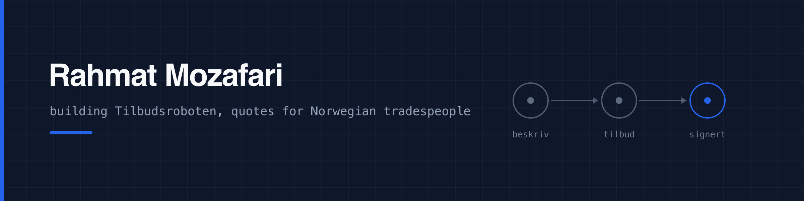

I build software for people who do not sit at a desk.

Right now that means **Tilbudsroboten**: a Norwegian app where tradespeople write, send and get quotes signed from the customer's driveway, instead of at the kitchen table at eleven at night. Voice in, a finished quote out, signed in the browser without an app or a login.

It is a product of **Inovix AS**. Not launched yet.

### What the work actually looks like

A monorepo with one app, one web portal and one database that has to be right, because a quote with the wrong sum is worse than no quote at all.

- **Money is integers of øre, computed in one place.** The language model proposes what to do and how much of it. It never sees a price and is never asked to add anything up.
- **Access control lives in the database, not in the client.** Row level security on every table, with a SQL test suite that logs in as four different users and tries to read what it should not. 107 assertions, and they have caught real holes.
- **Nothing is ever hard deleted.** Rows are marked, never removed. A company can be closed and reopened by its owner, and only by its owner.

### Stack

TypeScript everywhere. React Native and Expo for the app, Next.js for the web, Supabase and PostgreSQL underneath, Deno edge functions for anything with a secret in it, and the Anthropic API for the writing.

No Kubernetes. It is a monorepo and a managed database, and that is the right size for it.

### How I work

**Measure, do not guess.** A layout bug I had reasoned about for an hour turned out to be an image that never filled its box. The calculation was right and the premise was wrong. Contrast gets a number, token cost gets a number, and a guard gets a test that is made to fail on purpose before it is trusted.

**Write it so it survives being read again in a month.** Comments say why, not what. When a decision is reversed, the old reason gets deleted rather than left standing as a rule nobody follows.

**Only claim what is true.** That applies to a marketing page and to a README. Everything above is in the repository.

### Reach me

[rahmat@mozafari.no](mailto:rahmat@mozafari.no) · [inovix.no](https://inovix.no)
