<picture>
  <source media="(prefers-color-scheme: dark)" srcset="banner-dark.svg">
  
</picture>

I build software for people who are not sitting at a desk, and I ship it.

### Live

| | | |
|---|---|---|
| **Peskot** | Online multiplayer Hokm. Real time, real tables, no download. | [peskot.com](https://peskot.com) |
| **Cashlite** | Budgeting that tells you what you can actually spend today. | [cashlite.io](https://cashlite.io) |
| **DelbarMe** | Voice first matchmaking for the Afghan diaspora. | [delbarme.com](https://delbarme.com) |

Plus [inovix.no](https://inovix.no), the studio the rest of it comes out of.

### In progress

**Venito**, digital invitations. **Stamly**, booking and loyalty for salons. **NordCRM**. And the one below.

### Building now

**Tilbudsroboten**: a Norwegian app where tradespeople write, send and get quotes signed from the customer's driveway, instead of at the kitchen table at eleven at night. Voice in, a finished quote out, signed in the browser without an app and without a login. A product of Inovix AS, not launched yet.

A monorepo with one app, one web portal and one database that has to be right, because a quote with the wrong sum is worse than no quote at all.

- **Money is integers of øre, computed in one place.** The language model proposes what to do and how much of it. It never sees a price and is never asked to add anything up.
- **Access control lives in the database, not in the client.** Row level security on every table, with a SQL test suite that logs in as four different users and tries to read what it should not. 107 assertions, and they have caught real holes.
- **Nothing is ever hard deleted.** Rows are marked, never removed. A company can be closed and reopened by its owner, and only by its owner.

### Stack

TypeScript everywhere. React Native and Expo for the apps, Next.js for the web, Supabase and PostgreSQL underneath, Deno edge functions for anything holding a secret, and the Anthropic API for the writing.

No Kubernetes. A monorepo and a managed database is the right size for this.

### How I work

**Measure, do not guess.** A layout bug I had reasoned about for an hour turned out to be an image that never filled its box. The arithmetic was right and the premise was wrong. Contrast gets a number, token cost gets a number, and a guard gets a test that is made to fail on purpose before it is trusted.

**Write it so it survives being read again in a month.** Comments say why, not what. When a decision is reversed, the old reason is deleted rather than left standing as a rule nobody follows.

**Only claim what is true.** That applies to a landing page and to a README. Everything above is either running at a link up there or sitting in a repository.

### Reach me

[post@inovix.no](mailto:post@inovix.no) · [inovix.no](https://inovix.no)
